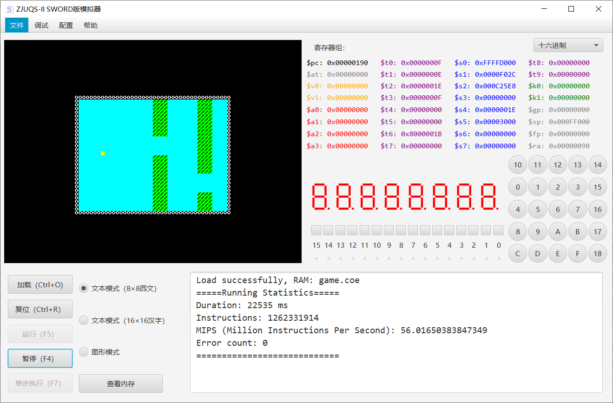

#  课程设计报告-软件部分

刘隽良 3180105957

## 项目概述

本项目旨在自己实现一个简易版本的MIPS多周期CPU，并使用MIPS汇编设计一个项目用以验证和展示CPU功能。本项目实现的汇编项目是一个简单版本的Flappy Bird游戏，于VGA板上以80*60西文模式显示，并通过PS2键盘控制。玩家控制方块躲避赶来的柱子，如若碰撞则游戏结束。游戏界面截图如下



## 项目设计流程

游戏可分为两大主体：柱子和小鸟，下面分别阐述设计思路

### 柱子的显示与更新

柱子宽4个字符，每次左移四个字符，游戏界面宽40个字符。因此，使用十个地址保存每个柱子的信息：空或是柱子上半部分的高度。项目中具体保存在`0x000f000`~`0x000f024`。

更新时，只需将内存中的值依次左移，并在最右边的位置加入随机的新柱子或是空当即可。我选择了生成伪随机数，通过查表来进行。随机数表储存在内存的`0x0000f034`~`0x0000f1bc`，并储存一个指针指向随机数表，地址为`0x0000f030`。

更新逻辑如下

```assembly
update_Ob:
    addi $sp, $sp, -16
    sw $ra, 4($sp)
    sw $s0, 8($sp)
    sw $s1, 12($sp)
    sw $s2, 16($sp)

    lui $t0, 0
    ori $t0, $t0, 0xf000 # ob position
    lui $t3, 0
    ori $t3, $t3, 0xf024 # duck position
    process_loop: # process 0xf000 - 0xf024
        lw $t1, 4($t0)
        sw $t1, 0($t0)
        addi $t0, $t0, 4
        ori $s4, $zero, 0xf024
        bne $t0, $s4, process_loop
    lui $t0, 0
    ori $t0, $zero, 0xf030 # address of random address
    lw $t1, 0($t0) # t1 got the random address
    lw $t4, 0($t1) # t4 got the random
    sw $t4, -12($t0) # save to 0xf024
    lui $s3, 0
    ori $t3, $zero, 0xf1c4
    addi $t1, $t1, 4
    bne $t3, $t1, set_new_addr
        ori $t1, $zero, 0xf034
    set_new_addr:
    sw $t1, 0($t0)

    jal draw_ob

    lw $ra, 4($sp)
    lw $s0, 8($sp)
    lw $s1, 12($sp)
    lw $s2, 16($sp)
    addi $sp, $sp, 16
jr $ra
```

显示时，只需进行循环即可，代码如下

```assembly
draw_ob:
    addi $sp, $sp, -16
    sw $ra, 4($sp)
    sw $s0, 8($sp)
    sw $s1, 12($sp)
    sw $s2, 16($sp)

    ori $s0, $zero, 0xf000 # ob info
    lui $s1, 0x000C
    ori $s1, $s1, 5200 # vga cursor

    ori $t0, $zero, 0
    ori $t1, $zero, 10
    draw_Ob_Outter_loop: # draw t0 th ob
        addi $t0, $t0, 1
        lw $s4, 0($s0) # load ob info to s4
        ori $s2, $zero, 0x202f # green o
        bne $s4, $zero, green
            ori $s2, $zero, 0x3000 #black O
            ori $s4, $zero, 5
        green:
        ori $t2, $zero, 0
        draw_Ob_Inner_loop1: # draw upper ob
            addi $t2, $t2, 1
            sw $s2, 0($s1)
            sw $s2, 4($s1)
            sw $s2, 8($s1)
            sw $s2, 12($s1)
            addi $s1, $s1, 320
        bne $t2, $s4, draw_Ob_Inner_loop1
        addi $s4, $s4, 5
        ori $s5, $zero, 0x3000 # black o
        draw_Ob_Inner_loop2: # draw upper ob
            addi $t2, $t2, 1
            sw $s5, 0($s1)
            sw $s5, 4($s1)
            sw $s5, 8($s1)
            sw $s5, 12($s1)
            addi $s1, $s1, 320
        bne $t2, $s4, draw_Ob_Inner_loop2
        ori $s4, $zero, 30
        draw_Ob_Inner_loop3: # draw lower ob
            addi $t2, $t2, 1
            sw $s2, 0($s1)
            sw $s2, 4($s1)
            sw $s2, 8($s1)
            sw $s2, 12($s1)
            addi $s1, $s1, 320
        bne $t2, $s4, draw_Ob_Inner_loop3
        addi $s1, $s1, -9600
        addi $s1, $s1, 16
        addi $s0, $s0, 4
    bne $t0, $t1, draw_Ob_Outter_loop

    lw $ra, 4($sp)
    lw $s0, 8($sp)
    lw $s1, 12($sp)
    lw $s2, 16($sp)
    addi $sp, $sp, 16
jr $ra
```

### 小鸟的显示与更新

小鸟由于横坐标固定，所以只需在指定内存(`0xf028`)储存小鸟的纵坐标即可。

更新时，则在循环时对PS消息区进行监听，若`w`或`s`被按下，则分别加减1。监听代码如下

```assembly
 #read PS and process 
    lui $s0, 0xffff
    ori $s0, $s0, 0xd000 # PS2 Addr
    ori $s1, $zero, 0xf028 # duck position Addr
    lw $t7, 0($s0) # Read PS2
    lui $t6, 0x8000
    ori $t6, $t6, 0x001D
    lw $t3, 0($s1) # Read Duck Position
    bne $t7, $t6, no_w
        ori $t4, $zero, 1
        beq $t3, $t4, top
            addi $t3, $t3, -1
        top:
        j draw
    no_w:
    lui $t6, 0x8000
    ori $t6, $t6, 0x00F0
    bne $t7, $t6, no_duan_ma
        lw $t7, 0($s0)
        ori $t7, $zero, 0
        j draw
    no_duan_ma:
    lui $t6, 0x8000
    ori $t6, $t6, 0x001B
    bne $t7, $t6, no_s
        ori $t2, $zero, 30
        beq $t3, $t2, bottom
            addi $t3, $t3, 1
        bottom:
        j draw

    no_s:
        sll $zero, $zero, 0
    # draw duck and judge
    draw:
    # draw process
```

显示时，则根据纵坐标在特定位置画上方块即可，代码如下

```assembly
 lw $t0, 0($s1) # Read Positon
 ori $t1, $zero, 0
 lui $s2, 0x000C
 ori $s2, $s2, 4904 # Bird Cursor
 draw_duck_loop1:
 addi $t1, $t1, 1
 addi $s2, $s2, 320
 bne $t1, $t0, draw_duck_loop1
 lw $t0, 0($s2)
 ori $t1, $zero, 0x202f
 beq $t0, $t1, game_over
 ori $t1, $zero, 0x6600
 sw $t1, 0($s2) # draw duck
```

### 游戏逻辑设计

整个游戏逻辑的循环分为两个部分：更新信息与画图。

具体设计是：对于柱子，因为移动速度较慢，在内存0xf02c处设置计时，每到某个值就对柱子进行左移并更新新的柱子，这个值可以根据情况进行调节。

而对于小鸟，因为要响应键盘事件，并且操作量不多，所以设计为每个循环都进行更新。

关于碰撞检测，则是在每次画小鸟前读取目标位置的颜色，如果是柱子，则判定为游戏失败。跳出循环，由于最近时间仓促以及其他课程大作业期末都比较多，所以计划在暑假做进一步的美化和完善。本项目软件部分的核心都已经开发完成，运行效果见介绍视频。

关键代码如下:

```assembly
game:
    lui $s1, 0
    ori $s1, $zero, 0xf02c # time count
    lw $s0, 0($s1)
    lui $s2, 0x0009
    bne $s0, $s2, no_update_Ob
        jal update_Ob # move the obstacles
        ori $s0, $zero, 0
    no_update_Ob:
    addi $s0, $s0, 1
    sw $s0, 0($s1)
    #read PS and process 
    lui $s0, 0xffff
    ori $s0, $s0, 0xd000 # PS2 Addr
    ori $s1, $zero, 0xf028 # duck position Addr
    lw $t7, 0($s0) # Read PS2
    lui $t6, 0x8000
    ori $t6, $t6, 0x001D
    lw $t3, 0($s1) # Read Duck Position
    bne $t7, $t6, no_w
        ori $t4, $zero, 1
        beq $t3, $t4, top
            addi $t3, $t3, -1
        top:
        j draw
    no_w:
    lui $t6, 0x8000
    ori $t6, $t6, 0x00F0
    bne $t7, $t6, no_duan_ma
        lw $t7, 0($s0)
        ori $t7, $zero, 0
        j draw
    no_duan_ma:
    lui $t6, 0x8000
    ori $t6, $t6, 0x001B
    bne $t7, $t6, no_s
        ori $t2, $zero, 30
        beq $t3, $t2, bottom
            addi $t3, $t3, 1
        bottom:
        j draw

    no_s:
        sll $zero, $zero, 0
    # draw duck and judge
    draw:
        lw $t0, 0($s1) # Read Positon
        beq $t0, $t3, no_cover
        ori $t1, $zero, 0
        lui $s2, 0x000C
        ori $s2, $s2, 4904 # Bird Cursor
        draw_duck_loop:
            addi $t1, $t1, 1
            addi $s2, $s2, 320
        bne $t1, $t0, draw_duck_loop
        lw $t0, 0($s2)
        ori $t1, $zero, 0x202f
        beq $t0, $t1, game_over
        ori $t1, $zero, 0x3000
        sw $t1, 0($s2) # draw duck

        sw $t3, 0($s1)
    no_cover:
        lw $t0, 0($s1) # Read Positon
        ori $t1, $zero, 0
        lui $s2, 0x000C
        ori $s2, $s2, 4904 # Bird Cursor
        draw_duck_loop1:
            addi $t1, $t1, 1
            addi $s2, $s2, 320
        bne $t1, $t0, draw_duck_loop1
        lw $t0, 0($s2)
        ori $t1, $zero, 0x202f
        beq $t0, $t1, game_over
        ori $t1, $zero, 0x6600
        sw $t1, 0($s2) # draw duck
        
j game
```

数据部分定义如下

```assembly
.data 0xf000
    .word 0  # 0xf000 obstacle positon 0
    .word 0  # 0xf004 obstacle positon 1
    .word 0  # 0xf008 obstacle positon 2
    .word 0  # 0xf00c obstacle positon 3
    .word 0  # 0xf010 obstacle positon 4
    .word 0  # 0xf014 obstacle positon 5
    .word 0  # 0xf018 obstacle positon 6
    .word 0  # 0xf01c obstacle positon 7
    .word 0  # 0xf020 obstacle positon 8
    .word 10 # 0xf024 obstacle position 9
    
    .word 15 # 0xf028 duck position

    .word 0  # 0xf02c time count
# rand count
    .word 0xf034 #0xf030
# random number
    .word  0 #0xf034
    .word  0 #0xf038
    .word 20 #0xf03c
    .word  0 #0xf040
    .word  0 #0xf044
    .word 15 #0xf048
    .word  0 #0xf04c
    .word  0 #0xf050
    .word 15 #0xf054
    .word  0 #0xf058
    .word  0 #0xf05c
    .word 20 #0xf060
    .word  0 #0xf064
    .word  0 #0xf068
    .word  5 #0xf06c
    .word  0 #0xf070
    .word  0 #0xf074
    .word 10 #0xf078
    .word  0 #0xf07c
    .word  0 #0xf080
    .word 10 #0xf084
    .word  0 #0xf088
    .word  0 #0xf08c
    .word 15 #0xf090
    .word  0 #0xf094
    .word  0 #0xf098
    .word 15 #0xf09c
    .word  0 #0xf0a0
    .word  0 #0xf0a4
    .word 10 #0xf0a8
    .word  0 #0xf0ac
    .word  0 #0xf0b0
    .word 15 #0xf0b4
    .word  0 #0xf0b8
    .word  0 #0xf0bc
    .word  5 #0xf0c0
    .word  0 #0xf0c4
    .word  0 #0xf0c8
    .word 15 #0xf0cc
    .word  0 #0xf0d0
    .word  0 #0xf0d4
    .word  5 #0xf0d8
    .word  0 #0xf0dc
    .word  0 #0xf0e0
    .word 15 #0xf0e4
    .word  0 #0xf0e8
    .word  0 #0xf0ec
    .word 10 #0xf0f0
    .word  0 #0xf0f4
    .word  0 #0xf0f8
    .word 10 #0xf0fc
    .word  0 #0xf100
    .word  0 #0xf104
    .word 15 #0xf108
    .word  0 #0xf10c
    .word  0 #0xf110
    .word 10 #0xf114
    .word  0 #0xf118
    .word  0 #0xf11c
    .word 20 #0xf120
    .word  0 #0xf124
    .word  0 #0xf128
    .word 15 #0xf12c
    .word  0 #0xf130
    .word  0 #0xf134
    .word 10 #0xf138
    .word  0 #0xf13c
    .word  0 #0xf140
    .word 10 #0xf144
    .word  0 #0xf148
    .word  0 #0xf14c
    .word 10 #0xf150
    .word  0 #0xf154
    .word  0 #0xf158
    .word 15 #0xf15c
    .word  0 #0xf160
    .word  0 #0xf164
    .word 20 #0xf168
    .word  0 #0xf16c
    .word  0 #0xf170
    .word 10 #0xf174
    .word  0 #0xf178
    .word  0 #0xf17c
    .word 15 #0xf180
    .word  0 #0xf184
    .word  0 #0xf188
    .word  5 #0xf18c
    .word  0 #0xf190
    .word  0 #0xf194
    .word 15 #0xf198
    .word  0 #0xf19c
    .word  0 #0xf1a0
    .word 10 #0xf1a4
    .word  0 #0xf1a8
    .word  0 #0xf1ac
    .word 15 #0xf1b0
    .word  0 #0xf1b4
    .word  0 #0xf1b8
    .word 15 #0xf1bc
```

